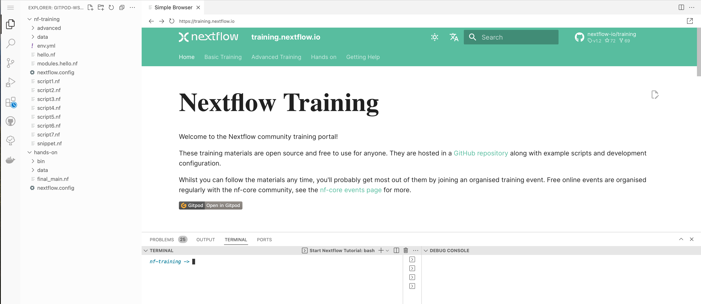

# Installation de l'environnement

Il y a deux façons principales de commencer avec le cours de formation communautaire de Nextflow.

La première consiste à installer les exigences [localement](#local-installation), ce qui est préférable si vous êtes déjà familier avec Git et Docker, ou si vous travaillez hors ligne.

La seconde consiste à utiliser [Gitpod](#gitpod), ce qui est préférable pour les débutants car cette plateforme contient tous les programmes et données nécessaires. Il suffit de cliquer sur le lien et de se connecter à l'aide de son compte GitHub pour commencer le tutoriel :

[](https://gitpod.io/#https://github.com/nextflow-io/training)

## Installation locale

Nextflow peut être utilisé sur n'importe quel système compatible POSIX (Linux, macOS, Windows Subsystem for Linux, etc.).

#### Exigences

-   Bash
-   [Java 11 (or later, up to 18)](https://www.oracle.com/technetwork/java/javase/downloads/index.html)
-   Git
-   [Docker](https://docs.docker.com/get-docker/)

#### Exigences optionnelles pour ce tutoriel

-   [Singularity](https://github.com/sylabs/singularity) 2.5.x (ou plus)
-   [Conda](https://conda.io/) 4.5 (ou plus)
-   [Graphviz](http://www.graphviz.org/)
-   [AWS CLI](https://aws.amazon.com/cli/)
-   Un environnement AWS Batch configuré

### Télécharger Nextflow

Entrez cette commande dans votre terminal :

```bash
wget -qO- https://get.nextflow.io | bash
```

Ou, vous préférez `curl`:

```bash
curl -s https://get.nextflow.io | bash
```

Then ensure that the downloaded binary is executable:

```bash
chmod +x nextflow
```

Et mettez l'exécutable `nextflow` dans votre `$PATH` (par exemple `/usr/local/bin` ou `/bin/`)

### Docker

Assurez-vous que Docker Desktop fonctionne sur votre machine. Téléchargez Docker [ici](https://docs.docker.com/get-docker/).

### Matériel de formation

Vous pouvez consulter le matériel de formation ici : <https://training.nextflow.io/>

Pour télécharger le matériel, utilisez la commande :

```bash
git clone https://github.com/nextflow-io/training.git
```

Puis `cd` dans le répertoire `nf-training`.

### Vérifier votre installation

Vérifiez l'installation correcte de `nextflow` en exécutant la commande suivante :

```bash
nextflow info
```

Cela devrait indiquer la version actuelle, le système et la durée d'exécution.

## Gitpod

Un environnement de développement Nextflow préconfiguré est disponible via Gitpod.

#### Exigences

- Un compte GitHub
- Navigateur web (Google Chrome, Firefox)
- Une connexion internet

### Démarrage rapide de Gitpod

Pour exécuter Gitpod :

-   Cliquez sur l'URL suivante : <https://gitpod.io/#https://github.com/nextflow-io/training>
    -   Il s'agit de l'URL de notre repositoire GitHub, préfixée par `https://gitpod.io/#`.
-   Connectez-vous à votre compte GitHub (et autorisez l'accès).

Une fois que vous vous êtes connecté, Gitpod devrait se charger (sautez le prebuild si on vous le demande).

### Explorez votre IDE Gitpod

Vous devriez maintenant voir quelque chose de similaire à ce qui suit :



-   **La barre latérale** vous permet de personnaliser votre environnement Gitpod et d'effectuer des tâches de base (copier, coller, ouvrir des fichiers, rechercher, git, etc.) Cliquez sur le bouton Explorer pour voir quels fichiers se trouvent dans ce dépôt.
-   **Le terminal** vous permet d'exécuter tous les programmes du repositoire. Par exemple, `nextflow` et `docker` sont installés et peuvent être exécutés
-   **La fenêtre principale** vous permet de visualiser et d'éditer des fichiers. En cliquant sur un fichier dans l'explorateur, vous l'ouvrez dans la fenêtre principale. Vous devriez également voir le materiel du navigateur de formation nf-training (<https://training.nextflow.io

Pour vérifier que l'environnement fonctionne correctement, tapez ce qui suit dans le terminal :

```bash
nextflow info
```

Vous devriez obtenir la version de Nextflow et des informations sur la durée d'exécution :

```
Version: 22.10.4 build 5836
Created: 09-12-2022 09:58 UTC
System: Linux 5.15.0-47-generic
Runtime: Groovy 3.0.13 on OpenJDK 64-Bit Server VM 17.0.3-internal+0-adhoc..src
Encoding: UTF-8 (UTF-8)
```

### Resources de Gitpod 

-   Gitpod vous offre 500 crédits gratuits par mois, ce qui équivaut à 50 heures d'utilisation gratuite de l'environnement en utilisant l'espace de travail standard (jusqu'à 4 cœurs, 8 Go de RAM et 30 Go d'espace de stockage).
-   Il existe également une option de grand espace de travail qui vous permet d'utiliser jusqu'à 8 cœurs, 16 Go de RAM et 50 Go d'espace de stockage. Cependant, le grand espace de travail utilisera vos crédits gratuits plus rapidement et vous aurez moins d'heures d'accès à cet espace.
-   Gitpod s'arrête au bout de 30 minutes d'inactivité et conserve les modifications jusqu'à deux semaines (voir la section suivante pour réouvrir une session interrompue).

Voir [gitpod.io](https://www.gitpod.io) pour plus de details.

### Réouvrir une session Gitpod

Vous pouvez reouvrir un environnement à partir de <https://gitpod.io/workspaces>. Recherchez votre ancien environnement dans la liste, puis sélectionnez l'ellipse (icône à trois points) et sélectionnez Ouvrir.

Si vous avez sauvegardé l'URL de votre précédent environnement Gitpod, vous pouvez simplement l'ouvrir dans votre navigateur.

Vous pouvez également démarrer un nouvel espace de travail en suivant l'URL de Gitpod : <https://gitpod.io/#https://github.com/nextflow-io/training>

Si vous avez perdu votre environnement, vous pouvez trouver les principaux scripts utilisés dans ce tutoriel dans le répertoire `nf-training`.

### Sauvegarde des fichiers de Gitpod sur votre machine locale

Pour enregistrer un fichier à partir du panneau de l'explorateur, cliquez avec le bouton droit de la souris sur le fichier et sélectionnez Télécharger.

### Matériel de formation

Le cours de formation est accessible dans votre navigateur à l'adresse suivante : <https://training.nextflow.io/>

## Sélection d'une version de Nextflow

Par défaut, Nextflow intègre la dernière version stable dans votre environnement.

Cependant, Nextflow est en constante évolution car nous apportons des améliorations et corrigeons des bugs.

Les dernières versions peuvent être consultées sur GitHub [ici](https://github.com/nextflow-io/nextflow).

Si vous souhaitez utiliser une version spécifique de Nextflow, vous pouvez définir la variable `NXF_VER` comme indiqué ci-dessous :

```bash
export NXF_VER=22.04.5
```

!!! Remarque

    Cet atelier tutoriel nécessite `NXF_VER=22.04.0`, ou une version plus récente. Cette version utilise DSL2 par défaut.

Exécutez `nextflow -version` à nouveau pour confirmer que le changement a pris effet.
